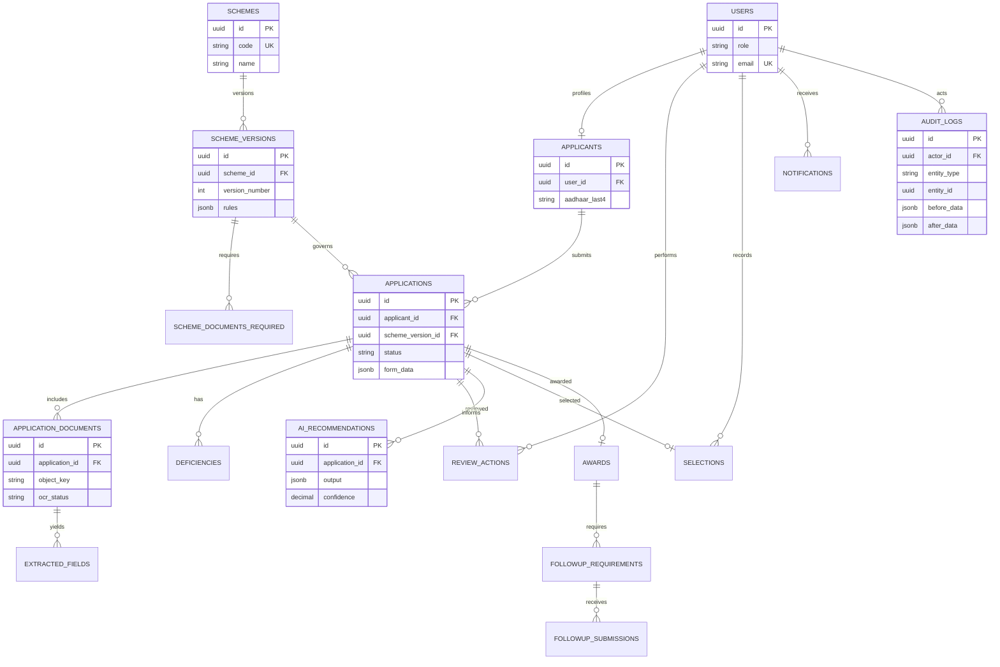

# Eklavya.AI domain ER diagram

```mermaid
erDiagram
    USERS ||--o| APPLICANTS : profiles
    USERS ||--o{ REVIEW_ACTIONS : performs
    USERS ||--o{ SELECTIONS : records
    USERS ||--o{ NOTIFICATIONS : receives
    SCHEMES ||--o{ SCHEME_VERSIONS : versions
    SCHEME_VERSIONS ||--o{ SCHEME_DOCUMENTS_REQUIRED : requires
    SCHEME_VERSIONS ||--o{ APPLICATIONS : governs
    APPLICANTS ||--o{ APPLICATIONS : submits
    APPLICATIONS ||--o{ APPLICATION_DOCUMENTS : includes
    APPLICATION_DOCUMENTS ||--o{ EXTRACTED_FIELDS : yields
    APPLICATIONS ||--o{ DEFICIENCIES : has
    APPLICATIONS ||--o{ REVIEW_ACTIONS : reviewed
    APPLICATIONS ||--o{ AI_RECOMMENDATIONS : informs
    APPLICATIONS ||--o| SELECTIONS : selected
    APPLICATIONS ||--o| AWARDS : awarded
    AWARDS ||--o{ FOLLOWUP_REQUIREMENTS : requires
    FOLLOWUP_REQUIREMENTS ||--o{ FOLLOWUP_SUBMISSIONS : receives
    USERS ||--o{ AUDIT_LOGS : acts

    USERS {
        uuid id PK
        string role
        string email UK
    }
    SCHEMES {
        uuid id PK
        string code UK
        string name
    }
    SCHEME_VERSIONS {
        uuid id PK
        uuid scheme_id FK
        int version_number
        jsonb rules
    }
    APPLICANTS {
        uuid id PK
        uuid user_id FK
        string aadhaar_last4
    }
    APPLICATIONS {
        uuid id PK
        uuid applicant_id FK
        uuid scheme_version_id FK
        string status
        jsonb form_data
    }
    APPLICATION_DOCUMENTS {
        uuid id PK
        uuid application_id FK
        string object_key
        string ocr_status
    }
    AI_RECOMMENDATIONS {
        uuid id PK
        uuid application_id FK
        jsonb output
        decimal confidence
    }
    AUDIT_LOGS {
        uuid id PK
        uuid actor_id FK
        string entity_type
        uuid entity_id
        jsonb before_data
        jsonb after_data
    }
```
