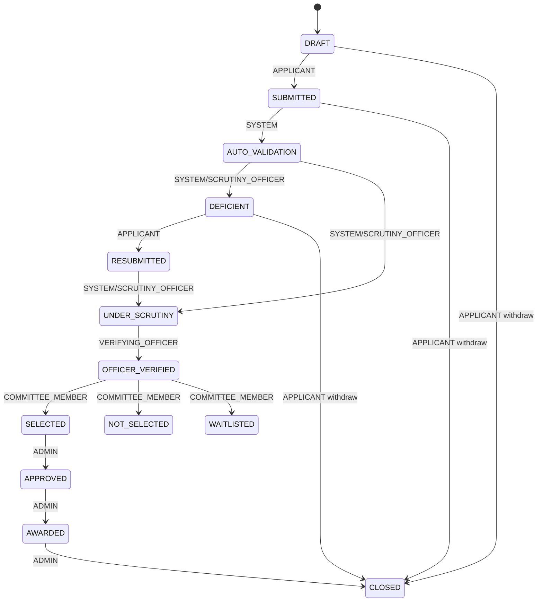

# Application lifecycle

The application service enforces the following state machine. Every transition
creates an `application_status_history` row and an audit entry. Applicant
withdrawal is represented by the terminal `CLOSED` state.

